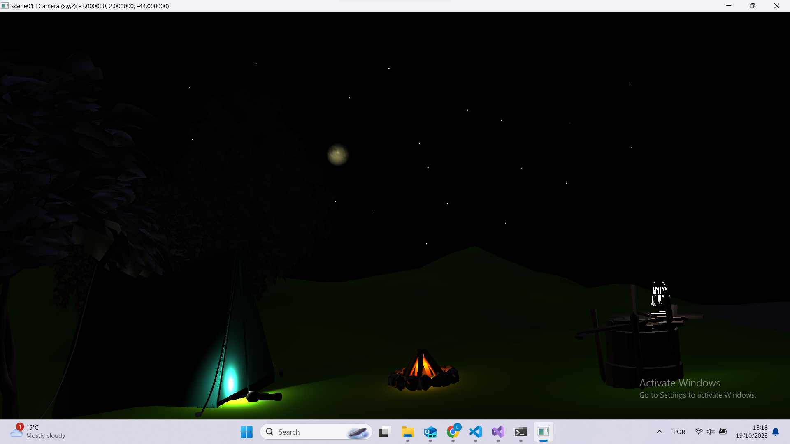

# Project 1 - Scene project

## About

Project 1 for "Graphics 1" class. A simple scene with iluminations and models placed to form a 3d scene.

## Requirements

- Visual studio 2022

## How to run

1. Unzip all libs from the .zip file in the "extern/lib/" folder
2. Open the solution in VS and click on play

## How to use

- To change any model, light or camera location you can just change the parameters on the "database" files
- To change in the scene you can also use these controls:
  - Close Window: GLFW_KEY_ESCAPE - Close the window when the GLFW_KEY_ESCAPE key is pressed.
  - Save Scene: GLFW_KEY_F1 - Save the scene when the GLFW_KEY_F1 key is pressed.
  - Reload Scene: GLFW_KEY_F5 - Reload the scene when the GLFW_KEY_F5 key is pressed.

  - CTRL key down + action key (Light controls):
    - Page Up (GLFW_KEY_PAGE_UP) and Page Down (GLFW_KEY_PAGE_DOWN) - Change the selected light.
    - A (GLFW_KEY_A) and D (GLFW_KEY_D) - Move the selected light in the X direction.
    - Q (GLFW_KEY_Q) and E (GLFW_KEY_E) - Move the selected light in the Y direction.
    - S (GLFW_KEY_S) and W (GLFW_KEY_W) - Move the selected light in the Z direction.
    - Z (GLFW_KEY_Z) and X (GLFW_KEY_X) - Change the linear attenuation of the selected light.
    - C (GLFW_KEY_C) and V (GLFW_KEY_V) - Change the quadratic attenuation of the selected light.
    - F (GLFW_KEY_F) and H (GLFW_KEY_H) - Change the direction of the selected light in the X-axis.
    - R (GLFW_KEY_R) and Y (GLFW_KEY_Y) - Change the direction of the selected light in the Y-axis.
    - G (GLFW_KEY_G) and T (GLFW_KEY_T) - Change the direction of the selected light in the Z-axis.
    - J (GLFW_KEY_J) and L (GLFW_KEY_L) - Change parameter 0 of the selected light.
    - U (GLFW_KEY_U) and O (GLFW_KEY_O) - Change parameter 1 of the selected light.
    - K (GLFW_KEY_K) and I (GLFW_KEY_I) - Change parameter 2 of the selected light.
    - B (GLFW_KEY_B) - Toggle the selected light.

  - SHIFT key down + action key (Mesh controls): Similar to light controls, but these actions apply to the selected mesh instead of the light.

  - No modifier key down (Camera controls):
    - A (GLFW_KEY_A) and D (GLFW_KEY_D) - Move the camera in the X direction.
    - Q (GLFW_KEY_Q) and E (GLFW_KEY_E) - Move the camera in the Y direction.
    - S (GLFW_KEY_S) and W (GLFW_KEY_W) - Move the camera in the Z direction.
    - Z (GLFW_KEY_Z) and X (GLFW_KEY_X) - Change the camera target in the X direction.
    - C (GLFW_KEY_C) and V (GLFW_KEY_V) - Change the camera target in the Y direction.

### Screenshots

